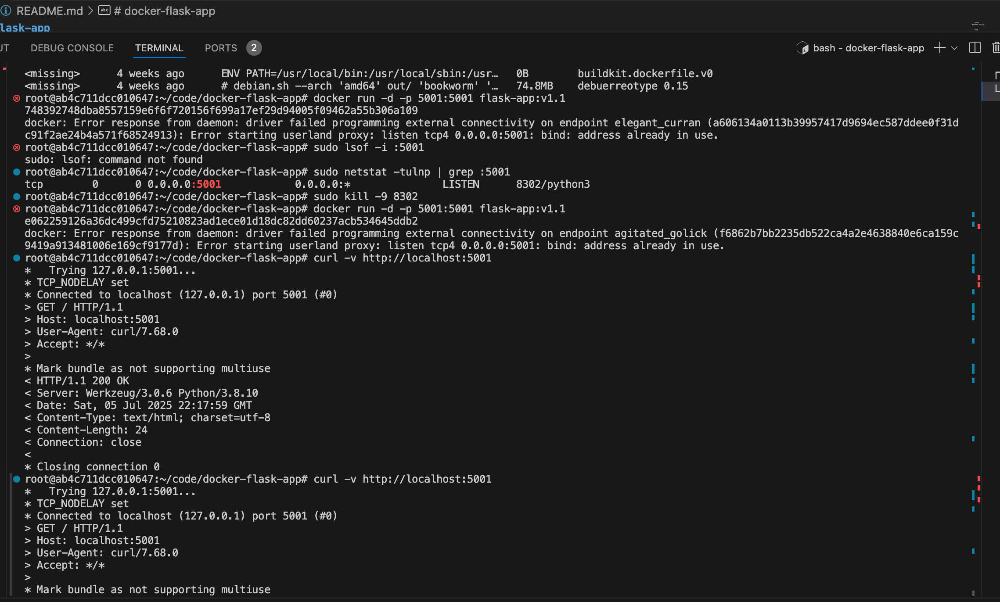

# docker-flask-app


 ```bash
apt-get install python3-pip
python3 -m venv venv
pip install -r requirements.txt
```

 ```bash
python3 app.py
```

```bash
docker build -t flask-app:v1.1 .
docker history 792cdfac1539
docker images
docker run -d -p 5001:5001 flask-app:v1.1
curl -v http://localhost:5001
```




 ```bash
sudo netstat -tulnp | grep :5001
```
-> Show TCP ports
-> Show UDP ports
-> Show listening ports
-> Show numeric addresses (instead of resolving hostnames)
-> Show process ID and name

 ```bash
docker run -d nginx
docker images
```


### For Mac [List All Network Interfaces]


 ```bash
ifconfig
networksetup -listallhardwareports
```

### For Linux [List All Network Interfaces]
 ```bash
ip link list
```

### We can install it via Homebrew:

 ```bash
brew install iproute2mac
```

 Then use:

 ```bash
ip link list
```